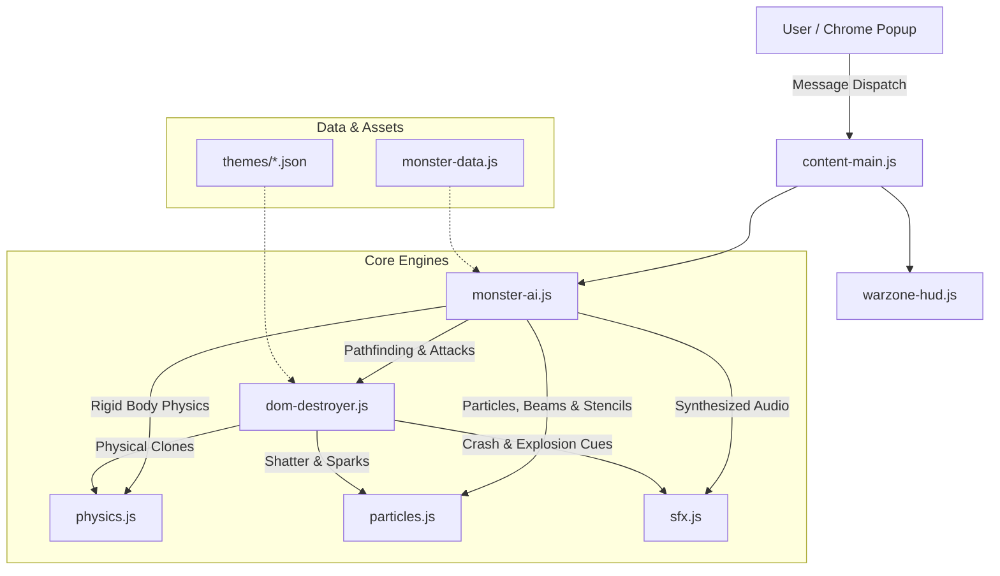

# Warzone Web Destroyer — System Architecture

This document provides a technical walkthrough of the sub-systems powering **Warzone Web Destroyer**.

---

## 1. Subsystem Architecture

---

## 2. Core Modules Breakdown

### 2.1 Web Audio API Synthesizer (`engine/sfx.js`)
* **Pure Mathematical Sound Generation**: Utilizes Web Audio `AudioContext` with zero audio sample files.
* **Sound Signatures**:
  * `playGunfire()`: Rapid white noise burst modulated through exponential decay + 4500Hz LPF with a 60Hz mechanical punch thump.
  * `playBowRelease()`: Damped triangle wave (twang) overlaid with a frequency whistle.
  * `playShieldRicochet()`: Vibranium metallic resonance using dual frequency ramps ($1480\text{Hz} \to 320\text{Hz}$).
  * `playWidowBite()`: High-frequency electro-taser buzzing with sawtooth waveform modulation.
  * `playPartyChampagne()`, `playPartyBeat()`, `playConstructionHammer()`: Dynamic celebration audio for victory settlements.

### 2.2 Realistic DOM Destroyer (`engine/dom-destroyer.js`)
* **Non-Destructive State Backup**: Records original `style`, `className`, `innerHTML`, and DOM hierarchy in an internal `Map` to enable instant $100\%$ restoration.
* **5 Devastation Shaders**:
  1. `burnElement()`: Charred grayscale filter, edge burning clip-path, and ash flake explosion.
  2. `eatElement()`: Jagged bite polygon masks and chewing scale deformation.
  3. `throwElement()`: Clones DOM element into a floating physics rigid-body and flings it across the document with angular torque and gravity.
  4. `crushElement()`: Telekinetic singularity compression into a dense point before exploding into debris.
  5. `sliceElement()`: Bisects elements into two falling halves with glowing molten edges.
* **Cleave Mechanics**: Cleaves $1\text{–}2$ sibling elements within a $260\text{px}$ radius for lightning-fast site blitzing.
* **Thematic Realm Construction**: Constructs bespoke headquarters, monuments, party banquets, and upgradeable settlements for all 14 conquerors.

### 2.3 Autonomous Monster AI & Vector Rigs (`engine/monster-ai.js`)
* **State Machine**: `spawning` $\to$ `idle` $\to$ `moving` $\to$ `attacking` $\to$ `defending` $\to$ `dying` $\to$ `victory`.
* **Autonomous Hunting**:
  * Continual roaming velocity so characters never freeze after destroying elements.
  * Species pack hunting (e.g. two Iron Mans performing pincer flanking maneuvers around Kong).
  * Sector-based vertical distribution to prevent swarm congestion.
* **Procedural 2D Vector Rigs**:
  * Hand-coded geometric rigs rendered onto an HTML5 canvas (flowing capes, rotating shields, full compound bow draws, dual gun recoil, glowing unibeams, spider webs).

### 2.4 Canvas Particles & Graffiti Stencils (`engine/particles.js`)
* **Particles**: Laser beams, lightning arcs, homing micro-missiles, flame cones, shockwaves, debris showers.
* **56 Signature Graffiti Stencils**: 4 distinct street-art vector stencils per character with realistic overspray mist, drip physics, and randomized angles.
* **Fading Sprays**:
  * Death sprays fade out over 3 seconds.
  * Victory sprays fade out smoothly over 4.5 seconds.

---

## 3. Chrome Extension Integration

* **Manifest V3 Compliant**: Uses declarative `content_scripts` and standard Chrome runtime messaging (`chrome.tabs.sendMessage`).
* **Auto-Injection Fallback**: If a tab was opened prior to extension loading, `popup.js` detects the connection drop and silently injects scripts on demand using `chrome.scripting`.
